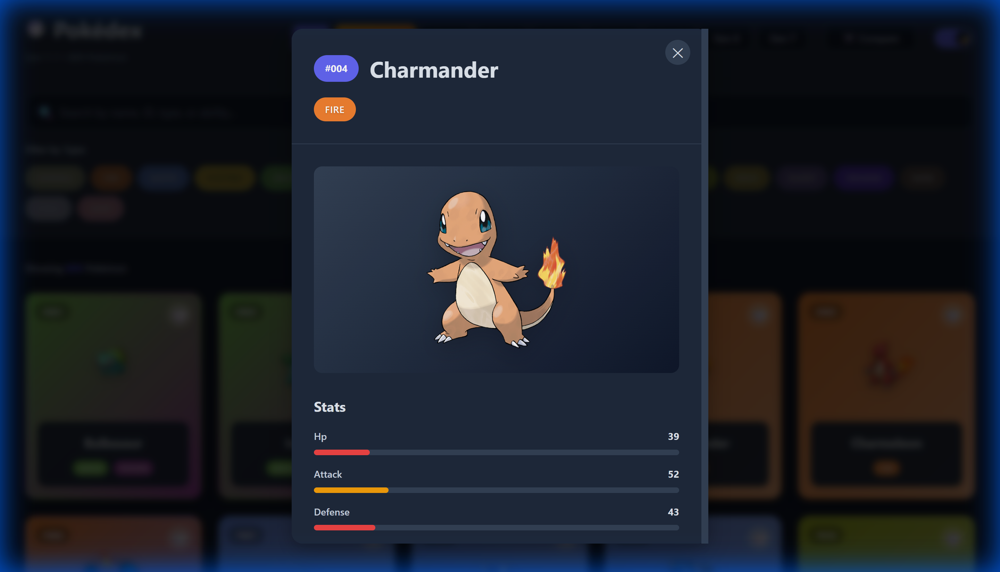
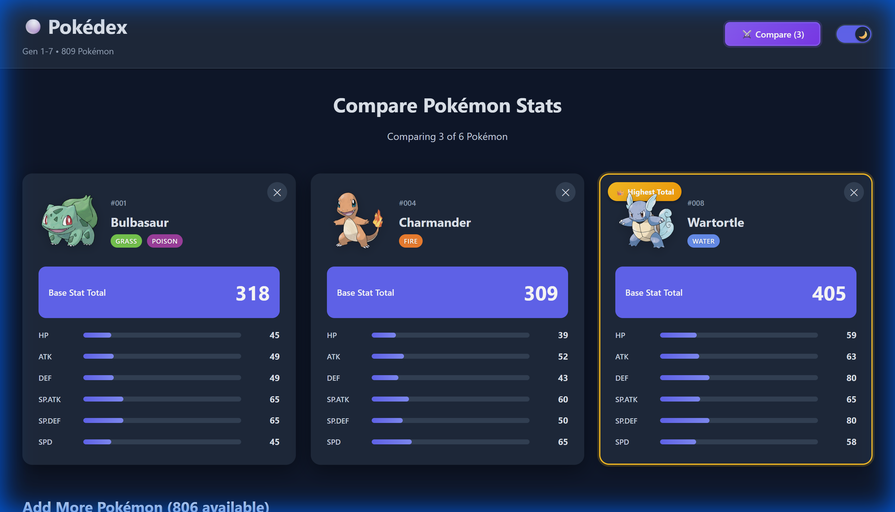
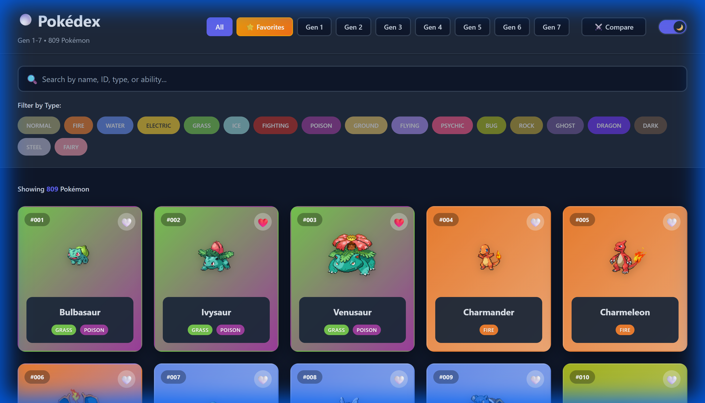

# Pokédex App

A modern, interactive Pokédex application built with React and Vite, featuring all 809 Pokémon from Generations 1-7.

## Features

### Browse & Filter
- **Grid View**: Browse all 809 Pokémon in a beautiful, responsive grid
- **Type Filters**: Filter by any Pokémon type (Fire, Water, Grass, etc.)
- **Generation Filters**: Search by generation (Gen 1-7)
- **Smart Search**: Quickly find Pokémon by name


### Detailed Information
Click any Pokémon to view:
- Base stats (HP, Attack, Defense, Speed, etc.)
- Types and type effectiveness
- Abilities and characteristics
- Evolution information



### Compare Pokémon
- Select multiple Pokémon to compare side-by-side
- Visual stat comparisons with charts
- Compare base stat totals across different Pokémon
- Perfect for team building and competitive analysis



### Favorites
- Mark your favorite Pokémon for quick access
- Filter to show only favorites
- Persistent storage (favorites saved locally)

## Getting Started

### Prerequisites
- Node.js (v14 or higher)
- npm or yarn

### Installation

1. Clone the repository:
```bash
git clone <repository-url>
cd pokodex
```

2. Install dependencies:
```bash
npm install
```

3. Start the development server:
```bash
npm run dev
```

4. Open your browser and navigate to `http://localhost:5173`

## Built With

- **React** - UI framework
- **Vite** - Build tool and dev server
- **CSS3** - Styling with modern features (gradients, animations, glassmorphism)
- **PokéAPI** - Pokémon data source

## Screenshots

### Main Grid View


## Design Features

- **Modern UI**: Vibrant colors, smooth gradients, and glassmorphism effects
- **Smooth Animations**: Micro-animations for enhanced user experience
- **Responsive Design**: Works seamlessly on desktop, tablet, and mobile
- **Dark Mode Compatible**: Eye-friendly color scheme
- **Type-Specific Colors**: Each Pokémon type has its own color theme

## Available Scripts

- `npm run dev` - Start development server
- `npm run build` - Build for production
- `npm run preview` - Preview production build
- `npm run lint` - Run ESLint

## Contributing

Contributions are welcome! Feel free to submit issues and pull requests.

## License

This project is open source and available under the MIT License.

## Acknowledgments

- Pokémon data provided by [PokéAPI](https://pokeapi.co/)
- Pokémon sprites and images © Nintendo/Game Freak
